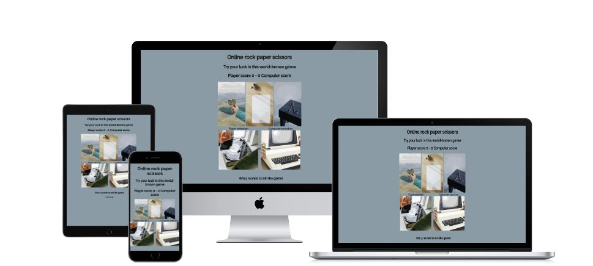
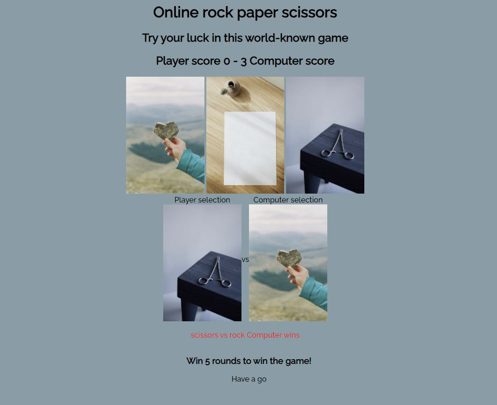
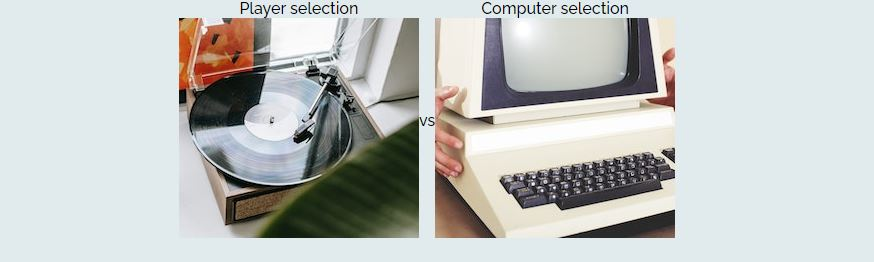
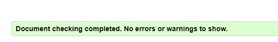
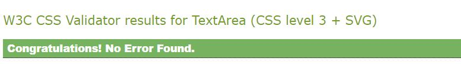
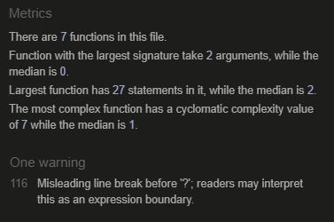
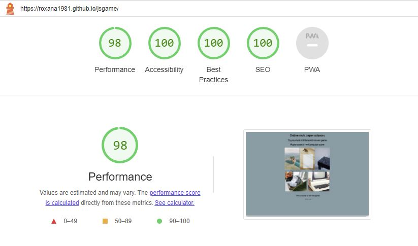
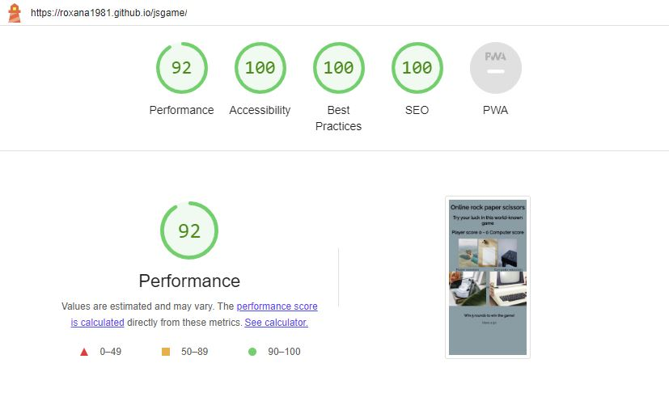

# Rock Paper Scissors Game by Roxana

Simple and entertaining Rock Paper Scissors online game. 

Play the game [here](https://roxana1981.github.io/jsgame/)

## Project 2

### Background

The game was created for completion of the second Milestone Project for the Software Development and E-commerce Applications diploma. It was built using the knowledge gained from HTML, CSS and JavaScrip modules of the course.
The objective of the game is to entertain users in a quick and simple way.

## User Experience 

The game was designed to be simple, in terms of the layout and the functionality to play. Visual elements such as pictures were added to attract users while making their choice of rock, paper or scissors. 

## Game design 

The game is displayed in a one page layout to allow a quick and simple user experience.

-**Game instructions** - The rule of the game is displayed only one sentence, aiming for quick reading, and inviting users to make their selection by clicking on an image of their choice.

-**Colors and background**- Colours of the website are light grey and black. Colours and background of the site are taught to be of a relaxing shade and elegant, with a retro style.

-**Typography** – I have selected font “Raleway” font sourced from Google Fonts library.

## Features 

### Game

The below demonstrates the entire user experience and the homepage of the game.

### Scores

In this specific section users will be able to see the current scores and the progress of the game.

### Selection Area

In this section, users, prior to starting a game will see 2 images representing the user player and the computer. Once the game starts, the images will be changed to selected choices by user and the computer.

### Options Area

In this section, users will be able to make their game selection by clicking on the image of their choice.

## Potential future developments

The following features are considered for future developments, in order to improve the game and enhance user experience:

1. Sizing of the images displayed in the game interface can be improved to create additionl wow factor.
2. Styling can be enhanced with focus on increasing the retro style of the game.
3. Favicon icon can be added to this project, to create individual feel for this game.
4. Game messaging can be improved to enhance user experience.
5. There is a scope to improve responsive user experience, specifically for smaller devices in order to better balance text and images on the screen.

## Testing 

As part of the project testing, the following test areas were completed.

**Functional**

The below functional tests were performed:

- It was verified that user selection was correctly displayed in the selection area.
- It was verified that user selection corresponded to a correct message displayed.
- It was verified that scores are updated accurately.
- It was verified that the logic to declare game's winner was correct.
- It was verified that the game ends after 5 rounds played.

**Responsive user experience**

- Tested the responsive design with break points of: 1200px, 1024px, 740px and 320px using Chrome dev tool.

- Testing was completed on the following devices: desktop, laptop, Ipad Mini and Samsung A51.

- Game page required some styling adjustments for the above break points.

- Media query at the break points of 525px and 425px have been added to CSS styling in order to enhance user experience.

- There are remaining possible changes in aim to improve the overall responsive user experience.

**Code testing**

The code was validated using HTML - W3C HTML Validator,CSS - Jigsaw CSS Validator and JavaScript - JSHint Validator.
Results following testing are outlined below:

**HTML code**

The code validation in W3C HTML Validator has not highlighted any code errors.

**CSS code**

The code validation in Jigsaw CSS Validator has not highlighted code errors.

**JavaScrip code**

The code validation in JSHint Validator has not highlighted code errors. One warning has been displayed regarding question mark in the code.

**Lighthouse – Dev Tools**

Game was tested on Lighthouse tool for desktop and mobile devices.

*Desktop*

*Mobile*

**Bugs**

## Deployment

The code was deployed through Github. Steps followed for the deployment were:

1. Access repository section in Github platform.
2. Go to the project to be deployed.
3. Navigate to settings.
4. Select Pages section.
5. Within "Build and Deployment" section, select the source "deploy from a branch", branch to be marked as “main” and folder as “root”.
6. Click Save.
7. After few seconds, site was confirmed to be live at: https://roxana1981.github.io/jsgame/

## Credits

Game images were sourced from Pexels website.

- Player image - credit to Alex Green at Pexels.

- Computer image - credit to Pixabay at Pexels.

- Scissors image - credit to Ekrulila at Pexels.

- Stone image - credit to Anna Urlapova at Pexels.

- Paper image - credit to Karolina Grabowska at Pexels.

-The project concept was influenced by Code Institute's JavaScript content and resource below:

https://sebhastian.com/rock-paper-scissors-javascript/

Dave Gray Youtube video: https://www.youtube.com/watch?v=C2_z34QFVjw

Thanky you to Code Institute for module content and also Slack community.

